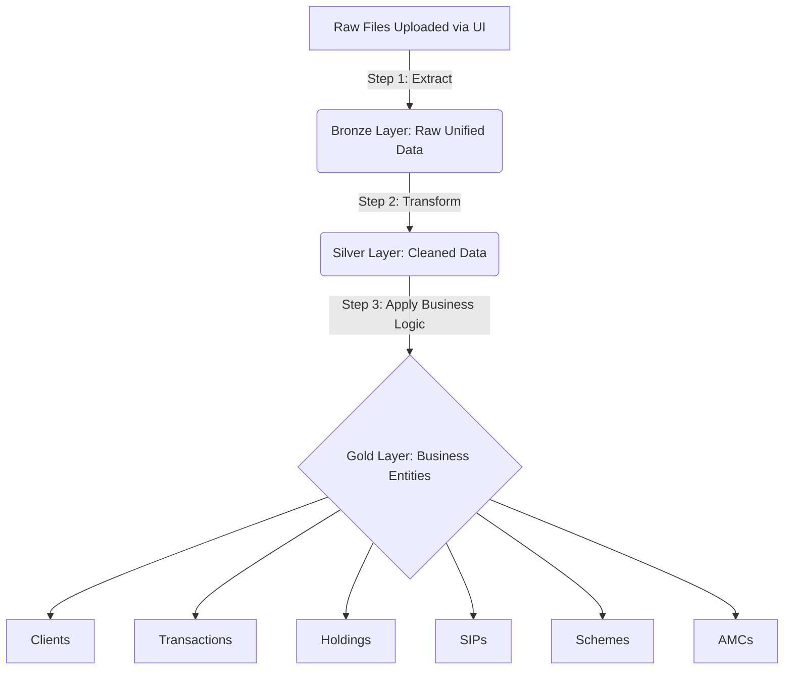

# Mutual Fund ETL Pipeline Architecture

This document provides a comprehensive overview of the architecture, data flow, and code logic for the Mutual Fund ETL (Extract, Transform, Load) project.

## 1. High-Level Architecture
The project follows a **Medallion Architecture** (Bronze, Silver, Gold layers) to process mutual fund data from two primary RTAs (Registrar and Transfer Agents): **CAMS** and **KFintech**. 

The system uses **Streamlit** for the frontend user interface, allowing users to upload raw files, trigger the ETL processes, and preview the data at each stage. The backend relies on **Pandas** for data manipulation and a SQL database for storage.

### 1.1 Medallion Layers
- **Bronze Layer (Raw):** Ingests raw files, normalizes file formats (CSV, TXT, Excel), standardizes column names using predefined mappings, and stores the raw data.
- **Silver Layer (Transformed):** Cleans the data, handles deduplication, formats dates and numbers, and applies intermediate business rules. 
- **Gold Layer (Curated):** Models the data into business-level entities (e.g., Clients, AMCs, Schemes, Transactions, Holdings) optimized for analytics and reporting.

---

## 2. Component Details & Code Logic

### 2.1 User Interface (`app.py`)
- **Logic:** Built with Streamlit, it manages the application state (`st.session_state`) to track the ETL progress. It provides an intuitive UI to upload files, trigger extraction, trigger transformation, and preview the data frames for Bronze, Silver, and Gold layers.
- **Purpose:** Acts as the control center for the user to interact with the ETL pipeline without needing to run terminal commands.

### 2.2 Raw Ingestion & Bronze Layer (`raw_ingestion.py`, `mapping.py`)
- **Logic:** 
  - `raw_ingestion.py` reads uploaded files, handling various encodings (`utf-8`, `latin1`) and delimiters. It performs initial cleaning by removing null characters, trailing whitespaces, and rogue quotes.
  - It identifies if a file belongs to CAMS or KFintech based on file naming conventions (e.g., `r2.csv` vs `mfsd201`).
  - `mapping.py` contains large dictionaries (e.g., `INVESTOR_MASTER_MAPPING`, `TRANSACTION_MASTER_MAPPING`) that map the disparate column names from CAMS and KFintech to a single, unified standard schema.
  - The unified data is then passed to specific processors (like `process_transactions`, `process_investor_master`) which load the data into the `bronze` schema tables.
- **Purpose:** To standardize unstructured and diverse raw data into a consistent tabular format before any complex transformations occur.

### 2.3 Silver Layer Transformation (`transformations/`)
- **Logic:** Triggered by `load_silver()` in the `app.py` file. While the specific scripts are in the `transformations` folder, the standard logic involves reading from the `bronze` tables, resolving data types (e.g., parsing dates, converting strings to floats), handling missing values, and preparing the data for dimensional modeling.
- **Purpose:** To create a reliable, cleansed, and unified source of truth from the raw data.

### 2.4 Gold Layer Processing (`gold_loader.py`, `etl_gold_*.py`)
- **Logic:** `gold_loader.py` acts as an orchestrator that sequentially calls the extraction, transformation, and loading functions for various business entities.
  - Entities include: `AMC`, `Scheme`, `Scheme NAV`, `Transactions`, `Holdings`, `SIP`, `Clients`, and `Folio Nominees`.
  - Each entity has its own dedicated script (e.g., `etl_gold_amc.py`). These scripts extract the cleansed data from the `silver` layer, apply business logic (like calculating current holdings based on transactions, aggregating client metrics, etc.), and load the final tables into the `gold` schema.
- **Purpose:** To provide highly structured, business-ready tables that can be directly connected to BI tools (like PowerBI, Tableau) or used for final reporting.

### 2.5 Supporting Scripts
- **`utils/` folder:** Contains helper modules like `db.py` (for database connections using SQLAlchemy) and `triggers.py` (for database triggers).
- **`sql_scripts/` folder:** Contains raw SQL files (e.g., `category_code.sql`, `state_code.sql`) used to populate static lookup tables or perform bulk SQL operations within the database.

---

## 3. Data Flow Summary

The following diagram illustrates the flow of data from raw files through the Medallion Architecture layers:

1. **Upload:** User uploads CAMS/KFintech `.csv`, `.txt`, or `.xlsx` files via the Streamlit UI.
2. **Extract (Bronze):** `raw_ingestion.py` reads the files, maps columns using `mapping.py`, and saves the raw data to the `bronze` database schema.
3. **Transform (Silver):** `load_silver()` cleans the data, corrects data types, and saves to the `silver` database schema.
4. **Load (Gold):** `gold_loader.py` executes individual entity scripts (e.g., `etl_gold_transactions.py`) to build the final business tables in the `gold` database schema.
5. **Preview:** The Streamlit UI fetches data from these database schemas and displays previews to the user.

---

## 4. Layer Mapping (Silver/Master to Gold)

The following outlines how specific fields from the Silver Layer (`silver`) and Master tables (`bronze` or `public`) are mapped to the final Gold Layer entities.

### 4.1 AMC (`gold.amc`)
- **`rta`**: `silver.transaction_master_new.source`
- **`amc_code`**: `silver.transaction_master_new.amc_code`
- **`name`**: `bronze.amc_master.amc_name` (joined via `amc_code`)

### 4.2 Clients (`gold.clients`)
- **`full_name`**: `silver.investor_master.investor_name`
- **`pan`**: `silver.investor_master.pan_no` (with fallbacks to `silver.transaction_master_new.pan` and `silver.sip_master_new.pan`)
- **`status`**: Hardcoded to `"ACTIVE"`

### 4.3 Folio Nominees (`gold.folio_nominees`)
- **`holding_id`**: Retrieved from `gold.holdings` by joining on `rta`/`source` and `folio_number`/`folio_no`.
- **`name`**: `silver.investor_master.nominee1_name` (also handles 2 and 3 sequentially)
- **`relationship`**: `silver.investor_master.nominee1_relation` (also handles 2 and 3)
- **`percentage`**: `silver.investor_master.nominee1_percentage` (also handles 2 and 3)

### 4.4 Holdings (`gold.holdings`)
- **`rta`**: `silver.transaction_master_new.source`
- **`pan`**: `silver.transaction_master_new.pan`
- **`folio_number`**: `silver.transaction_master_new.folio_no`
- **`units`**: `silver.transaction_master_new.units`
- **`market_value`**: `silver.transaction_master_new.amount`
- **`as_on_date`**: `silver.transaction_master_new.rep_date`
- **`folio_date`**: `silver.transaction_master_new.traddate`
- **`arn`**: `silver.investor_master.broker_code` (joined via `folio_no`)
- **`holding_nature`**: `silver.investor_master.holding_nature`
- **`kyc_status`**: Derives "Verified" if `silver.investor_master.ckyc_no` is present.
- **`bank_name` / `bank_ac_last4`**: `silver.investor_master.bank_name` / last 4 digits of `bank_account_no`
- **`scheme_id`**: Retrieved from `gold.scheme` via join on `prodcode`.

### 4.5 Scheme (`gold.scheme`)
- **`rta`**: `silver.transaction_master_new.source` or `silver.investor_master.source`
- **`scheme_code`**: `silver.transaction_master_new.prodcode` or `silver.investor_master.product_code`
- **`scheme_name`**: Coalesced from `funddesc`, `scheme`, `scheme_name`, `fund_description`.
- **`category`**: `silver.transaction_master_new.scheme_type` or `silver.investor_master.categorydesc`
- **`plan`**: Extracted from `scheme_name` (e.g., Direct or Regular).
- **`amfi_code`**: `public.scheme_master.scheme_code` (joined via normalized scheme name).

### 4.6 Scheme NAV (`gold.scheme_nav`)
- **`scheme_id`**: Retrieved from `gold.scheme` by matching `prodcode` -> `scheme_code`.
- **`nav_date`**: `silver.transaction_master_new.traddate`
- **`nav`**: `silver.transaction_master_new.purprice`
- **`source`**: `silver.transaction_master_new.source`

### 4.7 SIP (`gold.sip`)
- **`rta`**: `silver.sip_master_new.source`
- **`sip_reg_no`**: `silver.sip_master_new.ft_sip_regno` or `request_ref_no`
- **`folio_number`**: `silver.sip_master_new.folio_no`
- **`amount`**: `silver.sip_master_new.auto_amount`
- **`frequency`**: `silver.sip_master_new.periodicity`
- **`start_date` / `end_date` / `ceased_date`**: `from_date` / `to_date` / `cease_date`
- **`sip_day`**: `silver.sip_master_new.period_day`
- **`mandate_id`**: `silver.sip_master_new.umrn_code`

### 4.8 Transactions (`gold.transactions`)
- **`rta`**: `silver.transaction_master_new.source`
- **`rta_txn_no`**: `silver.transaction_master_new.trxnno`
- **`pan`**: `silver.transaction_master_new.pan`
- **`folio_number`**: `silver.transaction_master_new.folio_no`
- **`txn_type_raw`**: `silver.transaction_master_new.trxntype`
- **`txn_type`**: Custom classified based on `trxntype` and `trxn_nature` (e.g., PURCHASE, REDEMPTION, SIP).
- **`txn_date` / `post_date`**: `traddate` / `postdate`
- **`amount` / `units` / `nav`**: `amount` / `units` / `purprice`
- **`load_amount` / `stt` / `stamp_duty`**: `load` / `stt` / `stamp_duty`
- **`gst`**: Sum of `igst_amount`, `cgst_amount`, `sgst_amount`.
- **`arn` / `euin` / `sip_ref`**: `brokcode` / `euin` / `siptrxnno`
- **`scheme_id`**: Joined with `public.scheme_master` on `prodcode` -> `scheme_code`.
