# Automated ETL Pipeline — Full Documentation

This document covers the **cron-driven automatic pipeline** (`python_scripts/etl_pipeline/`), which is
separate from the manual Streamlit upload flow described in [architecture_documentation.md](architecture_documentation.md).

| | Manual flow | Automatic flow |
|---|---|---|
| Entry point | `streamlit run app.py`, a human clicks "Extract"/"Transform" | `python3 -m etl_pipeline.runner`, invoked by cron |
| Source of files | User uploads `.csv`/`.txt`/`.xlsx` by hand | Files are pulled from `intelli-wealth-backend`'s `/etl-handoff` queue and downloaded from S3 |
| Trigger | Human in the loop | Fixed interval (crontab) |
| Concurrency safety | N/A (one user, one session) | Postgres advisory lock — a second concurrent run exits immediately |
| Scope of this doc | — | Everything below |

The automatic pipeline reuses the **same** bronze → silver → gold code (`raw_ingestion.py`,
`etl_trans.py`, `etl_investor_master.py`, `etl_sip.py`, `gold_loader.py`) that the Streamlit app
calls — it is a different *orchestrator* around identical processing logic, not a rewrite.

---

## 1. What it does, end to end

1. Claims files from `intelli-wealth-backend`'s `/etl-handoff` queue via a REST API.
2. Downloads each file from its `source_s3_uri` using this repo's own AWS credentials.
3. **Holds** related report files until the full set for a distributor+date has arrived:
   - CAMS: `WBR2` (transactions) + `WBR9` (investor master) + `WBR49` (SIP)
   - KFIN: `MFSD211` (transactions) + `MFSD201` (investor master) + `MFSD243` (SIP)
4. Once a group is complete, runs it through the existing bronze → gold pipeline.
5. Reports the outcome back to `intelli-wealth-backend` via `PATCH /etl-handoff/{handoff_id}`.
6. Logs every step (per file, per layer) to a `pipeline.*` schema, so a run's full history is
   auditable.
7. Is safe to schedule on any interval with no risk of double-processing (advisory lock +
   content-hash dedup).

Reference design doc (full rationale, API contract, edge cases): [docs/superpowers/specs/2026-08-19-etl-pipeline-design.md](docs/superpowers/specs/2026-08-19-etl-pipeline-design.md).

---

## 2. Architecture

```mermaid
flowchart TD
    CRON[Cron tick, e.g. */15 * * * *] --> LOCK{pipeline_lock<br/>advisory lock free?}
    LOCK -- no --> EXIT[Exit immediately<br/>another run is active]
    LOCK -- yes --> PEEK[GET /etl-handoff/pending<br/>non-mutating peek]
    PEEK --> GROUP1[Coarse grouping by<br/>rta + arn_code + created_at date]
    GROUP1 --> READY{All required<br/>report codes present?}
    READY -- no --> HOLD[Upsert HOLDING row in<br/>pipeline.etl_report_group_hold<br/>log HOLD event]
    READY -- yes --> RESERVE[POST /etl-handoff/reservations<br/>loop until target set reserved]
    RESERVE --> GROUP2[Authoritative regroup by<br/>rta + arn_code + real S3 date]
    GROUP2 --> DEDUP{content_hash already<br/>in etl_processed_files?}
    DEDUP -- yes --> SKIP[PATCH COMPLETED with prior row count<br/>log SKIPPED_DUPLICATE]
    DEDUP -- no --> DOWNLOAD[Download from S3<br/>read_file into DataFrame]
    DOWNLOAD --> BRONZE[process_transactions /<br/>process_investor_master / process_sip<br/>log BRONZE]
    BRONZE --> GOLDCHECK{Whole group's<br/>bronze done?}
    GOLDCHECK -- yes --> GOLD[gold_loader.load_gold&#40;&#41;<br/>log GOLD per group]
    GOLD --> REPORT[PATCH each handoff_id<br/>COMPLETED / FAILED]
    REPORT --> MARK[mark_processed&#40;content_hash&#41;]
    MARK --> TIMEOUT[Sweep HOLDING groups older than<br/>ETL_HOLD_TIMEOUT_MINUTES -> TIMED_OUT]
    HOLD --> TIMEOUT
    SKIP --> TIMEOUT
    TIMEOUT --> RELEASE[Release advisory lock]
```



### Why the two-stage grouping?

`GET /pending` (a cheap, non-mutating peek) does **not** return `source_s3_uri` — only
`POST /reservations` does, and reservations are expensive (they burn one of a file's 3 retry
attempts). So the pipeline groups twice:

- **Stage 1 (coarse, from peek):** `rta|report_code|arn_code|created_at.date()` — good enough to decide
  "does this group look complete enough to attempt reserving."
- **Stage 2 (authoritative, from reservation):** `rta|report_code|arn_code|s3_date` where `s3_date` is
  parsed out of the real `source_s3_uri` (`.../{YYYY-MM-DD}/...`). This is the key actually
  used for all `pipeline.*` bookkeeping and the final "is this group really complete" decision.

**As of 2026-08-20, grouping is now per-report-code, not per-RTA-trio:** Each file (`WBR2`, `WBR9`,
`WBR49`, and the KFIN equivalents `MFSD211`, `MFSD201`, `MFSD243`) processes independently the
moment it is individually reserved — no longer waiting for its siblings. `required_report_codes(rta,
report_code)` returns just `{report_code}` (the file's self-requirement), and `pipeline.etl_report_group_hold`'s
`group_key` now includes the report code as its second `|`-delimited segment.

This is implemented in [`etl_pipeline/hold_groups.py`](python_scripts/etl_pipeline/hold_groups.py).

---

## 3. `runner.py` walkthrough (`run_once()`)

File: [`python_scripts/etl_pipeline/runner.py`](python_scripts/etl_pipeline/runner.py)

1. `pipeline_lock.try_acquire()` — Postgres `pg_try_advisory_lock`. If another instance already
   holds it, print a message and exit. This is what makes overlapping cron ticks safe.
2. `_discover_and_reserve(client, run_id)`:
   - `client.peek_pending(limit=ETL_PEEK_LIMIT)` (default 200).
   - Group by coarse key; incomplete groups get upserted into
     `pipeline.etl_report_group_hold` as `HOLDING` (and a `HOLD` event per file logged).
   - Complete coarse groups become the reservation target set.
   - `client.reserve(limit=ETL_BATCH_LIMIT)` is called in a loop (default batch 50) until the
     target set is reserved, the queue is drained, or `ETL_MAX_RESERVATION_CALLS_PER_RUN`
     (default 5) calls have been made — a hard cap on worst-case work per tick.
   - Reserved items are regrouped by the **authoritative** key and upserted into
     `etl_report_group_hold` with status `READY` (complete) or `HOLDING` (still missing a
     sibling — can happen due to the coarse/authoritative key mismatch, or an incidental
     reservation of an unrelated file that happened to be ahead in the FIFO queue).
3. `_run_bronze_for_ready_groups(client, run_id)` — iterates every group currently `READY` or
   `PROCESSING` (including ones left over from a prior run):
   - Skips a group if its required report code (the single file's own code) isn't present yet.
   - For each member file not yet bronze-processed:
     - `dedup.is_already_processed(content_hash)` — if already processed, mark
       `skipped_duplicate` and reuse the stored row count (no reprocessing, no re-download).
     - Otherwise `download_as_file(source_s3_uri, filename)` (S3) → `raw_ingestion.read_file()`
       → buffered per data type (`transaction`/`investor`/`sip`) and vendor (`cams`/`kfin`).
     - A download/read exception marks that file `FAILED`, `PATCH`es the backend, logs it, and
       drops that member from the group — the rest of the group is unaffected.
   - `_load_bronze(files_by_type)` concatenates CAMS+KFIN frames per type and calls
     `process_transactions` / `process_investor_master` / `process_sip` — the exact same bronze
     loaders the Streamlit app uses.
   - Every bronze-completed member gets a `BRONZE` log row; the group moves to `PROCESSING`.
4. If any group completed bronze this run: `gold_loader.load_gold()` runs **once** (it processes
   whatever is currently sitting in `silver`/`bronze`, not per-group — see "Known simplification"
   below), then `_report_gold_outcomes()`:
   - Aggregates `rows_loaded` across every gold entity; any entity with `status: "error"` fails
     the whole batch's gold outcome.
   - Logs one `GOLD` event per completed group (not per file).
   - `PATCH`es each member `COMPLETED` (with `rows_extracted`) or `FAILED`
     (`GOLD_LOAD_ERROR`) and calls `dedup.mark_processed()` on success.
   - Group status becomes `COMPLETED` (success) or stays `HOLDING` (gold failed — will be
     retried, since bronze is idempotent via the dedup check and gold's `ON CONFLICT` upserts
     make replays safe).
5. `_check_hold_timeouts()` — any group still `HOLDING` since before
   `ETL_HOLD_TIMEOUT_MINUTES` (default 240) is flagged `TIMED_OUT`. This is a **visibility
   signal only** — it never force-fails the arrived siblings (that would burn one of their 3
   retry attempts for a problem that isn't their fault). The backend's own 60-minute
   reservation TTL naturally recycles a stuck reservation.
6. `pipeline_lock.release(lock_conn)` in a `finally` block — always released, even on exception.

**Known simplification:** GOLD is logged once per completed *group*, not once per file within
the group, because `gold_loader.load_gold()` is a single global pass over all currently-eligible
silver data rather than being scoped to one group's rows.

---

## 4. Idempotency — why re-running never double-processes

Two independent layers of protection:

1. **Dedup at bronze:** [`etl_pipeline/dedup.py`](python_scripts/etl_pipeline/dedup.py) checks
   `pipeline.etl_processed_files` by `content_hash` before downloading/processing a file. A hit
   short-circuits straight to `PATCH COMPLETED` with the previously-recorded row count. This
   covers a worker crashing after committing DB writes but before the `PATCH` lands, and the
   same file content re-arriving under a new `handoff_id`.
2. **`ON CONFLICT` upserts at gold:** each `etl_gold_*.py` loader writes through
   [`utils/upsert.py`](python_scripts/utils/upsert.py)'s `upsert_dataframe()` against unique
   natural-key indexes added by `sql_scripts/add_constraints.sql`. Re-running gold on the same
   input is a no-op/update, not a duplicate insert — this is what makes retrying a
   partially-failed group safe.

Single-instance safety (no two cron ticks racing each other) is the advisory lock in
[`pipeline_lock.py`](python_scripts/etl_pipeline/pipeline_lock.py) (fixed lock key
`872234561`); a second concurrent `run_once()` call sees the lock held and exits immediately
without touching anything.

### SIP enrichment reconciliation

`gold.sip`'s enrichment (ARN, client ID, installment counts from transactions) differs from other
gold tables: holdings, clients, and folio_nominees self-heal automatically on every full gold
recompute (each `gold_loader` run processes all silver data). But SIP enrichment can't be
re-derived from a bare re-run of the same row — it depends on whether `silver.transaction_master_new`
and `gold.clients` *have arrived yet* at the time the row is first processed. A SIP row arriving
before WBR2 (transactions) or WBR9 (clients) will have missing ARN/client_id fields.

**`enrichment_pending_since` column:** A new TIMESTAMPTZ column (nullable) in `gold.sip`, set by
`transform_sip()` when **at least one** of the transaction match or client match was not found for a
row. This distinguishes "not yet resolved" from "resolved to nothing" (e.g., a genuine direct-plan
investment with no ARN, which is structurally complete even with a blank ARN field).

**Reconciliation process:** A new `reconcile_pending_sip(limit=200, max_age_days=30)` function runs
after every normal SIP load in `gold_loader.py`:

1. `extract_pending_sip_retry_candidates(limit, max_age_days)` fetches a bounded batch (default 200
   rows) of pending SIP rows from `gold.sip` whose `enrichment_pending_since` is within the age
   window (default 30 days old or newer).
2. Rejoins them to `silver.sip_master_new` via the same natural key (`rta`, `folio_number`,
   `scheme_code`, `registered_date`, `amount`) that `load_sip()`'s `ON CONFLICT` clause uses for
   row identity.
3. Uses `DISTINCT ON` to deduplicate at the join level — if multiple silver rows collide on the
   same natural key (a known phenomenon in live silver), only one is chosen per gold.sip pending
   row, preventing a `CardinalityViolation` that would otherwise fail the retry silently.
4. Runs the batch through the same `transform_sip()` / `load_sip()` path as a normal load. Rows
   whose enrichment *still* can't be resolved get re-stamped with a fresh `enrichment_pending_since`
   and retry again next run, until either they resolve or age past `max_age_days`.
5. Result row counts are combined with the primary load's; result status is carefully merged so a
   successful reconciliation never masks a real primary-load failure (worse-of-two status always
   wins in the final result).

This runs **every `gold_loader.load_gold()` invocation**, both in the automatic pipeline and in
manual runs — cost is bounded (default 200 rows per run) and it's idempotent (re-running is safe,
since the same `ON CONFLICT` upsert logic applies).

---

## 5. Data model (`pipeline` schema)

Defined in [`sql_scripts/etl_pipeline_schema.sql`](sql_scripts/etl_pipeline_schema.sql), idempotent (every statement is `CREATE ... IF NOT EXISTS`).

- **`pipeline.etl_pipeline_log`** — one row per (file, layer) event. `layer` is
  `HOLD | BRONZE | GOLD`; `status` is `HOLDING | COMPLETED | FAILED | SKIPPED_DUPLICATE`, etc.
  `run_id` groups every row from one cron invocation; `group_key` links R2/R9/R49 (or KFIN
  equivalent) siblings together. `api_response` (`JSONB`) holds the raw backend response body
  from that event's `report_outcome()` PATCH call — including on a 4xx (e.g. the exact 422
  validation message when a `failure_reason` value is rejected) — kept for reference/debugging;
  `NULL` for events with no associated PATCH call (e.g. `HOLD`).
- **`pipeline.etl_report_group_hold`** — cross-run memory of what's waiting on siblings, one row
  per distributor+date group. `status` progresses `HOLDING → READY/PROCESSING → COMPLETED`
  (or `TIMED_OUT`). `members` is a JSONB map of `report_code → {handoff_id, filename,
  content_hash, bronze_done, ...}`.
- **`pipeline.etl_processed_files`** — idempotency guard, keyed by `content_hash`.

---

## 6. Component reference

| File | Responsibility |
|---|---|
| `etl_pipeline/config.py` | Loads all tuning/credentials from `.env` via `python-dotenv`. Nothing hardcoded. |
| `etl_pipeline/api_client.py` | `EtlHandoffClient` — JWT login (auto re-login on 401), `peek_pending()`, `reserve()`, `report_outcome()`. |
| `etl_pipeline/s3_client.py` | Parses `s3://bucket/key`, downloads via `boto3`, returns a `BytesIO` with `.name` set so it plugs straight into `raw_ingestion.read_file()`. |
| `etl_pipeline/hold_groups.py` | Pure functions: coarse/authoritative grouping, readiness checks. No I/O — the highest-value unit tests live here. |
| `etl_pipeline/dedup.py` | `is_already_processed()` / `mark_processed()` against `etl_processed_files`. |
| `etl_pipeline/pipeline_lock.py` | Postgres advisory lock for single-instance safety. |
| `etl_pipeline/logging_repo.py` | Writes `etl_pipeline_log` rows and upserts `etl_report_group_hold`. |
| `etl_pipeline/runner.py` | Entry point / orchestrator — see §3. |
| `raw_ingestion.py`, `etl_trans.py`, `etl_investor_master.py`, `etl_sip.py` | Shared bronze-layer processing, same code the Streamlit app calls. |
| `gold_loader.py` + `etl_gold_*.py` | Shared gold-layer processing; each `load_*()` returns `{"rows_loaded", "status", "error"}` (see `utils/gold_result.py`) instead of print-and-swallow. |
| `utils/db.py` | Two SQLAlchemy engines: `engine` (project DB — bronze/silver/gold/pipeline schemas) and `master_engine` (intelli-wealth-backend's own DB, e.g. `public.arn`) — separate credentials/host. |
| `utils/upsert.py` | Generic `upsert_dataframe()` helper (temp-table + `INSERT ... ON CONFLICT`) used by the gold loaders. |

---

## 7. Testing the automatic pipeline

Test layout: `python_scripts/tests/etl_pipeline/` (pipeline-specific) plus several
pipeline-related files directly under `python_scripts/tests/`.

| Test file | Covers | Needs live DB? | Needs network/AWS? |
|---|---|---|---|
| `tests/etl_pipeline/test_hold_groups.py` | Grouping/readiness pure functions | No | No |
| `tests/etl_pipeline/test_dedup.py` | `is_already_processed`/`mark_processed` | Yes (project DB) | No |
| `tests/etl_pipeline/test_pipeline_lock.py` | Advisory lock acquire/release | Yes (project DB) | No |
| `tests/etl_pipeline/test_logging_repo.py` | `log_event`/`upsert_group_hold`/queries | Yes (project DB) | No |
| `tests/etl_pipeline/test_api_client.py` | `EtlHandoffClient` (mocked `requests`) | No | No (mocked) |
| `tests/etl_pipeline/test_s3_client.py` | `download_as_file` (mocked `boto3`) | No | No (mocked, but `boto3` must be **importable**) |
| `tests/etl_pipeline/test_runner.py` | Full `run_once()` HOLDING path, integration-style | Yes (project DB) | No (`EtlHandoffClient`/`download_as_file`/`gold_loader` are mocked) |
| `tests/test_db_config.py` | `.env` values load correctly, engines point at the right DB/host, `engine` is actually reachable | Yes | No |
| `tests/test_etl_pipeline_config.py` | `config.py` values/types/defaults | No | No |
| `tests/test_pipeline_schema.py` | `pipeline.*` tables/columns exist | Yes | No |
| `tests/test_upsert.py`, `test_gold_upsert_*.py` | `upsert_dataframe()` and per-table `ON CONFLICT` behavior — proves re-running a gold loader twice on identical input does **not** duplicate rows | Yes | No |
| `tests/test_gold_result.py` | `load_result()` shape | No | No |
| `tests/test_etl_trans_drop_duplicates.py` | Exact-duplicate row removal in `etl_trans.py` | No | No |
| `tests/test_folio_nominees_arn.py` | `arn` present in `gold.folio_nominees` output | Depends on fixtures used | No |

Most of these tests are **integration-style against a real, reachable Postgres database** — they
are not mocked at the DB layer — so a working dev DB with the pipeline schema applied is a
prerequisite for a full green run, not just for manual testing.

### Running the tests

```bash
cd python_scripts
source venv/bin/activate
pip install -r requirements.txt        # make sure boto3/requests/python-dotenv are present
pytest tests/ -v                        # everything
pytest tests/etl_pipeline/ -v           # pipeline package only
pytest tests/etl_pipeline/test_hold_groups.py -v   # fast, no I/O — good for TDD
```

> As of this writing, the checked-in `venv/` does **not** have `boto3` installed, which makes
> `tests/etl_pipeline/test_runner.py` and `tests/etl_pipeline/test_s3_client.py` fail to
> **collect** (import error, not a test failure) until `pip install -r requirements.txt` is
> (re-)run inside that venv.

### What `test_runner.py` actually proves

It drives `runner.run_once()` end-to-end with `EtlHandoffClient`, `download_as_file`, and
`gold_loader` all mocked, but writes to the **real** `pipeline.etl_pipeline_log` /
`etl_report_group_hold` tables (cleaned up in a `finally` block). Example case: peek two of
three required CAMS files (`WBR2`, `WBR9`, missing `WBR49`) → asserts the group is held (status
`HOLDING`), `reserve`/`download`/`report_outcome` are never called, and no premature processing
happens. This is the pattern to extend for new scenarios (full 3-file group → `COMPLETED`,
duplicate content skip, gold failure → group stays `HOLDING`, etc.).

### Manual end-to-end test (no real backend/S3 needed)

Since `EtlHandoffClient` and `download_as_file` are the only things touching the outside world,
you can exercise the whole hold → bronze → gold path locally by monkeypatching those two in a
throwaway script/REPL to return canned `peek`/`reserve` payloads and a local file buffer, then
calling `etl_pipeline.runner.run_once()` and inspecting:

```sql
SELECT * FROM pipeline.etl_pipeline_log ORDER BY created_at DESC LIMIT 20;
SELECT * FROM pipeline.etl_report_group_hold ORDER BY last_updated_at DESC;
```

against your dev DB, and the resulting `bronze.*` / `silver.*` / `gold.*` tables via the
Streamlit app's preview panels or straight SQL.

### Testing against a real staging backend

Point `.env`'s `INTELLIWEALTH_API_BASE` at a real `intelli-wealth-backend` instance (with a
seeded `ETL_RUNNER` service account) and just run `python3 -m etl_pipeline.runner` once — watch
the console output and the `pipeline.*` tables. Safe to re-run repeatedly: the lock and dedup
guards mean nothing gets double-processed even if you invoke it back-to-back.

---

## 8. Setting up on a development server

### 8.1 Prerequisites

- Python 3.13 (matches the checked-in `venv/`).
- A reachable **project** PostgreSQL database (bronze/silver/gold/pipeline schemas) — PostgreSQL
  14+ (the `add_constraints.sql` gold-layer indexes were written/verified against 14.23).
- A reachable **master** PostgreSQL database — `intelli-wealth-backend`'s own DB (for
  `public.arn`, etc.) — separate host/credentials from the project DB.
- Network access to an `intelli-wealth-backend` instance exposing `/api/v1/etl-handoff/*` (local,
  staging, or shared dev — whichever this environment should pull files from), and a seeded
  `ETL_RUNNER` service account on it (ask the backend team).
- AWS credentials (or an S3-compatible endpoint) able to read the bucket
  `intelli-wealth-backend` writes handoff files to.

### 8.2 Install

```bash
git clone <this repo>
cd intelliwealth_layer_old_code/python_scripts
python3 -m venv venv
source venv/bin/activate
pip install -r requirements.txt
```

### 8.3 Configure `.env`

```bash
cp .env.example .env
```

Fill in every value — see [`python_scripts/.env.example`](python_scripts/.env.example) for the
full annotated list:

| Variable | Meaning |
|---|---|
| `DB_HOST`, `DB_PORT`, `DB_USER`, `DB_PASSWORD`, `DB_NAME` | This repo's own project DB (bronze/silver/gold/pipeline) |
| `MASTER_POSTGRES_HOST`, `MASTER_POSTGRES_PORT`, `MASTER_POSTGRES_USER`, `MASTER_POSTGRES_PASSWORD`, `MASTER_POSTGRES_DB` | `intelli-wealth-backend`'s own DB — **separate** creds/host, e.g. its docker-compose service name rather than `localhost` |
| `AWS_ACCESS_KEY_ID`, `AWS_SECRET_ACCESS_KEY`, `AWS_REGION`, `AWS_S3_ENDPOINT_URL` | S3 access for downloading handoff files (`AWS_S3_ENDPOINT_URL` optional — only for an S3-compatible endpoint) |
| `INTELLIWEALTH_API_BASE` | Base URL of the `/etl-handoff` API, e.g. `http://localhost:8000/api/v1` |
| `INTELLIWEALTH_RUNNER_EMAIL` / `INTELLIWEALTH_RUNNER_PASSWORD` | The seeded `ETL_RUNNER` service account credentials — get from the backend team |
| `ETL_RUNNER_NAME` | Identifies this worker instance to the backend (default `de-etl-worker-1`) |
| `ETL_BATCH_LIMIT` | Rows per `POST /reservations` call (default 50) |
| `ETL_PEEK_LIMIT` | Rows per `GET /pending` call (default 200) |
| `ETL_HOLD_TIMEOUT_MINUTES` | How long a group can sit `HOLDING` before being flagged `TIMED_OUT` (default 240) |
| `ETL_MAX_RESERVATION_CALLS_PER_RUN` | Safety cap on `POST /reservations` calls per tick (default 5) |

### 8.4 Apply the database schema

Run once (all scripts are idempotent, safe to re-run):

```bash
psql "$DB_URL" -f ../sql_scripts/dedup_cleanup.sql        # only if the DB has pre-existing dupes
psql "$DB_URL" -f ../sql_scripts/add_constraints.sql       # gold-layer unique indexes (ON CONFLICT support) — CONCURRENTLY builds, run outside a transaction
psql "$DB_URL" -f ../sql_scripts/etl_pipeline_schema.sql   # pipeline.* tracking tables
```

`add_constraints.sql` must run **after** `dedup_cleanup.sql`'s census queries show zero
duplicate rows on every gold table — every index in it fails to build otherwise (see the header
comment in that file for the exact PG14 nullable-column workaround it uses).

### 8.5 Verify the setup

```bash
pytest tests/test_db_config.py tests/test_pipeline_schema.py tests/test_etl_pipeline_config.py -v
```

This confirms both DB engines connect and the `pipeline` schema tables/columns exist.

### 8.6 Run once, manually

```bash
python3 -m etl_pipeline.runner
```

### 8.7 Schedule it with cron

```cron
*/15 * * * * cd /path/to/intelliwealth_layer_old_code/python_scripts && \
  venv/bin/python3 -m etl_pipeline.runner >> /var/log/etl_pipeline.log 2>&1
```

The `*/15` interval is an example, not a fixed requirement — tune it to whatever cadence ops
wants without touching any code (nothing about cadence lives in this repo). Overlapping ticks are
safe: the second invocation sees the advisory lock held and exits immediately.

### 8.8 Observability / troubleshooting on the dev server

```sql
-- Every event from the most recent runs
SELECT * FROM pipeline.etl_pipeline_log ORDER BY created_at DESC LIMIT 50;

-- Groups currently stuck waiting on a sibling report, or that timed out
SELECT * FROM pipeline.etl_report_group_hold
WHERE status IN ('HOLDING', 'TIMED_OUT')
ORDER BY first_seen_at;
```

- `pipeline.etl_pipeline_log` — one row per (file, layer) event (`HOLD`, `BRONZE`, `GOLD`; `GOLD`
  is logged per-group, not per-file — see §3's "Known simplification").
- `pipeline.etl_report_group_hold` — current state of every distributor+date group.

### 8.9 Known gaps to be aware of on a fresh dev setup

- The checked-in `venv/` may be missing `boto3` (or other requirements) — always re-run
  `pip install -r requirements.txt` after cloning/pulling before running tests or the runner.
- Every test that touches `pipeline.*`, `bronze.*`, `silver.*`, or `gold.*` tables needs the SQL
  in §8.4 applied first, and a genuinely reachable project + master DB — there is no sqlite/mock
  DB fallback in this codebase.
- `INTELLIWEALTH_RUNNER_EMAIL`/`PASSWORD` must be a real seeded `ETL_RUNNER` account on whatever
  `intelli-wealth-backend` instance `INTELLIWEALTH_API_BASE` points at, or `run_once()` will fail
  at login on its very first API call.
