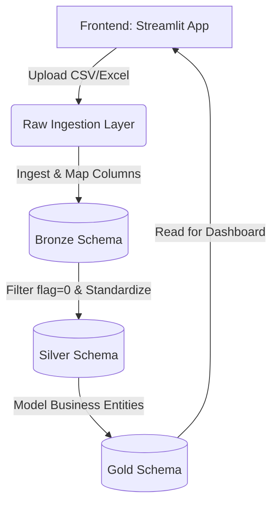

# Developer Guide: Inteliwealth Data Pipeline Architecture

This document provides a logical walkthrough of how data flows from the user interface (Frontend) through the **Medallion Architecture** (Bronze, Silver, and Gold tables) in the Inteliwealth project. It is designed to help new developers understand the Python codebase, database interactions, and ETL (Extract, Transform, Load) pipelines.

---

## 1. High-Level Architecture Overview

The data pipeline follows a **Medallion Architecture**, which organizes data into three distinct processing layers to ensure clean, structured, and reliable data modeling:



| Layer | Target Schema | Purpose | Key Operations |
| :--- | :--- | :--- | :--- |
| **Bronze** | `bronze` | Raw data ingestion | Reads raw CSV/Excel files, maps columns from CAMS/KFIN schemas, and identifies duplicate records using a `flag` column. |
| **Silver** | `silver` | Cleaned & standardized data | Casts data types, standardizes mappings (states, occupations, account types), and appends unique new rows. |
| **Gold** | `gold` | Business-level reporting entities | Aggregates and models data into final business entities (AMC, Clients, Scheme, Holdings, SIP, etc.) for dashboard visualization. |

---

## 2. Frontend User Interface (`app.py`)

The user interacts with the pipeline using a **Streamlit** dashboard. Streamlit is a Python library used to build interactive web applications for data science.

### Key Workflows in the Frontend:
1. **File Uploading**: The user uploads Excel or CSV files exported from mutual fund transfer agents (**CAMS** or **KFintech**).
2. **File Classification**: The application identifies the type of file automatically by checking its filename:
   - **CAMS Files**:
     - `*r9.csv` $\rightarrow$ Investor Master Data
     - `*r2.csv` $\rightarrow$ Transaction Master Data
     - `*r49.csv` $\rightarrow$ SIP Master Data
   - **KFIN Files**:
     - `*mfsd211*` $\rightarrow$ Investor Master Data
     - `*mfsd201*` $\rightarrow$ Transaction Master Data
     - `*mfsd243*` $\rightarrow$ SIP Master Data
3. **Execution Triggers**:
   - **🟢 Extract Raw Data Button**: Triggers `extract_and_push()` to load files into the **Bronze** layer.
   - **🟡 Transform Data Button**: Triggers `load_silver()` and `load_gold()` to clean and promote data to **Silver** and **Gold** layers.

---

## 3. Step-by-Step Data Flow

### Step 1: Raw File Ingestion (`raw_ingestion.py`)
When the user clicks **Extract Raw Data**, `raw_ingestion.py` processes each uploaded file:
1. **Decoding & Cleaning**: Reads files under multiple potential encodings (`utf-8`, `utf-16`, `latin1`), removes NUL bytes (`\x00` characters that break standard CSV parsers), and normalizes newline characters (`\r\n` to `\n`).
2. **Parsing**: Uses the Python `csv` module or `pandas.read_excel` to parse files into a Pandas **DataFrame** (a tabular data structure in memory).
3. **Routing**: Grouped files are sent to their respective ingestion scripts:
   - **Investor Master** $\rightarrow$ `etl_investor_master.py`
   - **Transactions** $\rightarrow$ `etl_trans.py`
   - **SIPs** $\rightarrow$ `etl_sip.py`

---

### Step 2: Ingesting into Bronze Layer
Taking `etl_investor_master.py` as a primary example, the raw DataFrames are structured and inserted into the `bronze` schema:

#### 1. Column Mapping (`mapping.py`)
Different source systems (CAMS vs KFIN) use different names for the same attributes (e.g., CAMS might use `INV_NAME` while KFIN uses `INVESTOR_NAME`). 
* The system uses mapping configurations in `mapping.py` (e.g., `INVESTOR_MASTER_MAPPING`) to align columns to a standard Bronze schema format.

#### 2. Data Sanitization & Cleaning
* **Identifier Float Protection**: Identifiers like folio numbers, phone numbers, and pincodes can sometimes be incorrectly read as floats (e.g., `12345.0`). The `clean_identifier_columns` function strips `.0` suffix strings to prevent database validation errors.
* **Date Standardization**: Parses dates using `pd.to_datetime` and coerces invalid/missing dates to `None` (SQL `NULL`).
* **Trimming Strings**: Strips extra whitespace and quotes from text columns.

#### 3. Incremental Load & Duplicate Flagging
* The script reads the existing records from `bronze.investor_master`.
* It normalizes and converts both new and existing records into concatenated string keys representing complete row contents (e.g., `value1|value2|value3`).
* It sets the `flag` column:
  - **`flag = 1`**: If the exact row already exists in the Bronze table (duplicate).
  - **`flag = 0`**: If it is a new record.
* Writes the records to PostgreSQL under `bronze.investor_master` using Pandas `to_sql()` with `if_exists="append"`.

---

### Step 3: Transforming into Silver Layer (`transformations/transform.py`)
When the user clicks **Transform Data**, the script `load_silver()` executes.

#### 1. Fetching New Records Only
It queries the Bronze tables, retrieving only the newly added rows where the duplicate flag is zero:
```sql
SELECT * FROM bronze.investor_master WHERE flag = 0
```

#### 2. Standardization Rules
The silver transformation cleans and maps codes to human-readable names or standard primary keys:
* **Occupation Codes**: Maps occupation strings (e.g., "SERVICE", "BUSINESS") to standardized integer IDs based on a predefined dictionary.
* **State Codes**: Normalizes Indian state names and fills missing GST state codes by querying a state master table (`bronze.state_code`).
* **Holding Nature & Account Types**: Standardizes values (e.g., mapping `"SAV"`, `"SAVINGS"` $\rightarrow$ `"Savings"`).

#### 3. Row Key Check and Insertion
* Checks `silver.investor_master` for duplicate entries using a similar row hashing method (`create_row_key`).
* Appends only unique records into PostgreSQL schema `silver` (e.g., `silver.investor_master`, `silver.transaction_master_new`).

---

### Step 4: Loading into Gold Layer (`gold_loader.py` & `etl_gold_*.py`)
Finally, `load_gold()` is executed to build specialized tables optimized for reporting.

#### 1. Splitting / Join Operations
Instead of raw dumps, the gold layer stores distinct operational entities:
* **`gold.amc`**: Extracted unique Asset Management Companies (AMCs) from transactional data.
* **`gold.scheme`**: Cleaned list of mutual fund schemes.
* **`gold.scheme_nav`**: Daily Net Asset Values of schemes.
* **`gold.clients`**: Extracted list of investors mapped by unique combinations of PAN, Email, and Phone number.
* **`gold.transactions`**: Normalized financial transactions.
* **`gold.holdings`**: Current unit holdings of portfolios.
* **`gold.folio_nominees`**: Nominee allocations associated with folios.
* **`gold.sip`**: Regular Systematic Investment Plans.

#### 2. Execution Logic
Each sub-entity has its own script (e.g., `etl_gold_amc.py`):
1. **`extract_amc()`**: Reads new/modified records from `silver.transaction_master_new` where `created_at` is greater than the last gold execution timestamp.
2. **`transform_amc()`**: Aggregates records, cleans strings, and removes duplicates.
3. **`load_amc()`**: Inserts or updates the records in `gold.amc`.

---

## 4. Key Python Concepts Used

If you are new to Python, here are the most important packages and concepts used in this pipeline:

### 1. Pandas (`import pandas as pd`)
Pandas is the primary library for data manipulation.
* **DataFrame**: A table-like object. You can perform SQL-like operations on it.
* **`pd.concat([df1, df2])`**: Merges two tables vertically (equivalent to `UNION ALL` in SQL).
* **`df.to_sql(...)`**: Sends a DataFrame directly into a PostgreSQL table.
* **`df.map(...)` or `df.replace(...)`**: Transforms values in columns based on a translation map.

### 2. SQLAlchemy (`from sqlalchemy import create_engine`)
A database toolkit for Python.
* **`create_engine`**: Opens a connection pool to your PostgreSQL database.
* **`pd.read_sql(query, engine)`**: Executes a SELECT query on PostgreSQL and returns the results directly as a Pandas DataFrame.

### 3. Streamlit (`import streamlit as st`)
Allows building interactive UIs.
* **`st.file_uploader`**: Renders a file upload box.
* **`st.button`**: Renders a button and returns `True` if clicked.
* **`st.session_state`**: A dictionary that persists values between user clicks or page reloads (since Streamlit runs the script from top to bottom on every user action).

---

## 5. Summary of Directory Structure

```text
Inteliwealth/
├── python_scripts/
│   ├── app.py                      # Streamlit frontend entrypoint
│   ├── raw_ingestion.py            # Manages file reading and routing to Bronze
│   ├── etl_investor_master.py      # Cleans and loads raw Investor files to Bronze
│   ├── etl_trans.py                # Cleans and loads raw Transaction files to Bronze
│   ├── etl_sip.py                  # Cleans and loads raw SIP files to Bronze
│   ├── mapping.py                  # Column translation mappings (CAMS/KFIN -> Standard)
│   ├── gold_loader.py              # Orchestrator for Gold ETL scripts
│   ├── etl_gold_amc.py             # Prepares gold AMC table
│   ├── etl_gold_clients.py         # Prepares gold Clients table
│   ├── etl_gold_holdings.py        # Prepares gold Holdings table
│   ├── etl_gold_scheme.py          # Prepares gold Scheme table
│   ├── etl_gold_transaction.py     # Prepares gold Transaction table
│   ├── etl_gold_sip.py             # Prepares gold SIP table
│   │
│   ├── transformations/
│   │   └── transform.py            # Silver layer loading and transformations
│   │
│   └── utils/
│       ├── db.py                   # Database engine setup and standard read/write queries
│       └── triggers.py             # Executes post-load database triggers
└── sql_scripts/                    # Contains database schema creation scripts
```

---

## 6. How to Add a New Gold Table (Step-by-Step)

If you need to introduce a new business entity or report table in the `gold` schema (for example, `gold.brokerage_summary`), follow this step-by-step checklist:

### Step A: Define the Target Table in PostgreSQL
Create the target table in your database schema under the `gold` namespace. You can execute this via a database client or add the DDL script under the `sql_scripts/` directory:
```sql
CREATE TABLE gold.brokerage_summary (
    id SERIAL PRIMARY KEY,
    amc_code VARCHAR(20) NOT NULL,
    total_brokerage NUMERIC(15, 4) DEFAULT 0,
    created_at TIMESTAMP WITHOUT TIME ZONE DEFAULT CURRENT_TIMESTAMP,
    updated_at TIMESTAMP WITHOUT TIME ZONE DEFAULT CURRENT_TIMESTAMP
);
```

### Step B: Create the ETL Script (`python_scripts/etl_gold_brokerage.py`)
Create a new Python file in the `python_scripts/` directory. Structure the script to contain three standard procedures: `extract`, `transform`, and `load`.

#### 1. Implement Last Processed Tracker (for Incremental Loading)
To load only new records since the last run:
```python
import pandas as pd
import traceback
from utils.db import engine

def get_last_processed_time():
    try:
        result = pd.read_sql("SELECT MAX(created_at) AS last_time FROM gold.brokerage_summary", engine)
        last_time = result.iloc[0]["last_time"]
        return pd.Timestamp("1900-01-01") if pd.isna(last_time) else pd.to_datetime(last_time)
    except Exception:
        return pd.Timestamp("1900-01-01")
```

#### 2. Implement Extraction from Silver/Bronze
Query the source tables (usually from `silver` schema) where the record was created after the last processed time:
```python
def extract_brokerage():
    last_time = get_last_processed_time()
    query = f"""
        SELECT amc_code, brokerage_amount, created_at 
        FROM silver.transaction_master_new 
        WHERE created_at > '{last_time}'
    """
    return pd.read_sql(query, engine)
```

#### 3. Implement Transformation (Mapping and Deduplication)
Clean columns, apply transformations, drop duplicates, and align columns with the destination database table schema:
```python
def transform_brokerage(df):
    if df.empty:
        return pd.DataFrame()
    
    # 1. Clean values and resolve types
    df["amc_code"] = df["amc_code"].fillna("").astype(str).str.strip().str.upper()
    df["brokerage_amount"] = pd.to_numeric(df["brokerage_amount"], errors="coerce").fillna(0.0)
    
    # 2. Aggregations / business calculations
    summary_df = df.groupby("amc_code")["brokerage_amount"].sum().reset_index()
    summary_df.columns = ["amc_code", "total_brokerage"]
    
    # 3. Trim length safety checks
    summary_df["amc_code"] = summary_df["amc_code"].str[:20]
    
    return summary_df
```

#### 4. Implement Destination Loading with Duplicate Protection
Query existing entries, do a left-merge to filter out records that are already present, and use `.to_sql()` with `if_exists="append"` to load the new ones:
```python
def load_brokerage(gold_df):
    if gold_df.empty:
        return True
    
    try:
        # Load existing target records to check for duplicates
        existing = pd.read_sql("SELECT amc_code, created_at FROM gold.brokerage_summary", engine)
        
        if not existing.empty:
            # Match existing using the natural key
            gold_df = gold_df.merge(existing, on="amc_code", how="left", suffixes=("_new", "_old"))
            # Retain only rows where matching old created_at timestamp is NULL
            gold_df = gold_df[gold_df["created_at"].isna()]
            # Drop the merge helper column
            gold_df = gold_df.drop(columns=["created_at"])
        
        if gold_df.empty:
            return True
            
        # Write to Gold table
        gold_df.to_sql(
            name="brokerage_summary",
            con=engine,
            schema="gold",
            if_exists="append",
            index=False,
            method="multi",
            chunksize=5000
        )
        return True
    except Exception as e:
        traceback.print_exc()
        return False
```

### Step C: Orchestrate the Load in `gold_loader.py`
To ensure the new gold ETL script executes as part of the overall pipeline, modify `gold_loader.py`:

1. **Import the functions** at the top of the file:
   ```python
   from etl_gold_brokerage import extract_brokerage, transform_brokerage, load_brokerage
   ```
2. **Add a block** inside the main `load_gold()` function:
   ```python
   # =====================================================
   # GOLD BROKERAGE SUMMARY
   # =====================================================
   try:
       print("\nLoading Gold Brokerage Summary")
       raw_df = extract_brokerage()
       if not raw_df.empty:
           gold_df = transform_brokerage(raw_df)
           if not gold_df.empty:
               load_brokerage(gold_df)
               print("Brokerage summary loaded successfully")
       else:
           print("No new brokerage data found")
   except Exception as e:
       print("Gold Brokerage summary failed:", e)
   ```

### Step D: Expose the Table Preview in UI (`app.py`)
To view the resulting database table inside the dashboard preview panel:
1. Open `app.py` and locate the `transform_btn` block where `gold_data` is defined.
2. Add your new table to the `gold_data` dictionary:
   ```python
   gold_data["Brokerage Summary"] = read_table(
       "gold",
       "brokerage_summary"
   )
   ```
Now the new gold table data will automatically be queryable, loaded during execution, and displayed inside the frontend Streamlit dashboard under the **⭐ Gold Layer Preview** section.

---

## 7. How to Debug File Uploads

If a file fails to upload, parse, or insert into the database, you can debug it using the following techniques:

### 1. Check the Streamlit UI Error Panel
* If an exception occurs during the ingestion stage, the Streamlit app catches it and displays a red warning panel with a full Python traceback.
* Inspect the traceback to locate the exact file and line number where the error occurred (e.g., `etl_investor_master.py:L618` during a `to_sql` call).

### 2. View Terminal / Console Logs
* Since the Streamlit server runs in the terminal (command: `streamlit run app.py`), all Python `print()` statements output directly to the terminal stdout.
* Look for the detailed file information printed by `raw_ingestion.py` during upload:
  ```text
  Processing file: cams_investor_r9.csv
  Shape: (150, 42)
  Columns: 42
  Unique columns: 42
  Duplicate columns: []
  ```
* If rows are skipped due to column mismatches, you will see warnings like:
  ```text
  Skipping bad row. Expected: 42 Found: 40
  ```

### 3. Verify Filename Routing Patterns
If you upload a file and the dashboard reports `0 files processed` or doesn't show the expected layer, verify the filename matches the rules in `app.py` (lines 182-200) and `raw_ingestion.py` (lines 247-268):
* **CAMS Files**:
  * Name must end with `r9.csv` (Investor), `r2.csv` (Transactions), or `r49.csv` (SIPs).
* **KFIN Files**:
  * Name must contain substring `mfsd211` (Investor), `mfsd201` (Transactions), or `mfsd243` (SIPs).

If files are renamed or compressed, the router will mark them as `Unknown file type` in the terminal logs and skip them.

### 4. Run a Standalone Python Debug Script
You don't need to run the Streamlit UI to test file ingestion. You can run a quick standalone script to parse a file locally:

1. Create a temporary script (e.g., `debug_upload.py` in the workspace root).
2. Use this sample code:
   ```python
   import sys
   # Add python_scripts to path if running from parent directory
   sys.path.append("./python_scripts")

   from raw_ingestion import read_file, extract_and_push

   class MockFile:
       def __init__(self, filepath):
           self.name = filepath
           self.file = open(filepath, "rb")
       def read(self):
           return self.file.read()
       def seek(self, offset):
           self.file.seek(offset)

   # Test parsing a single local file
   filepath = "path/to/your/cams_investor_r9.csv"
   mock_file = MockFile(filepath)

   print("Testing file read...")
   df = read_file(mock_file)
   print("Successfully read. Row count:", len(df))
   print("Columns found:", df.columns.tolist())
   ```
3. Run the script using Python:
   ```bash
   python debug_upload.py
   ```
